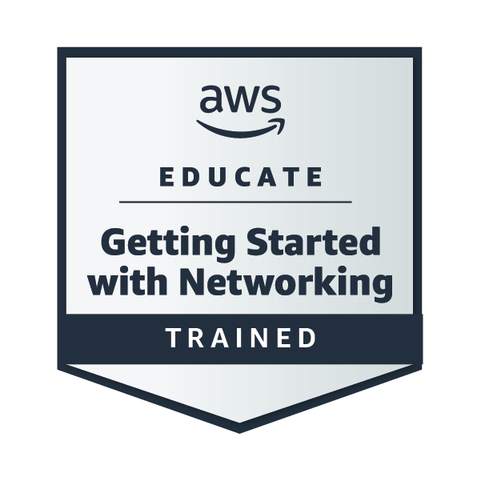

## AWS Educate: Cloud Computing 101-Trained

  

 
✅ Issued to: Ejay Ardimer | April 27, 2026  
[Verify on Credly](https://www.credly.com/badges/0391ca79-032a-4a39-a7d8-9c27ad320de4/public_url)

**Skills Verified:** Amazon EC2, S3, IAM, VPC, Lambda, Cloud Architecture, Security, Pricing

---

## AWS Educate: Getting Started with Storage-Trained

  

✅ Issued to: Ejay Ardimer | April 28, 2026  
[Verify on Credly](https://www.credly.com/badges/2076d919-5be2-437f-a036-afa926f5297a/public_url)

**Skills Verified:** Amazon S3, Amazon EBS, Amazon EFS, Storage Classes, Data Durability, Cloud Storage Fundamentals

---

## AWS Educate: Getting Started with Compute - Trained

  

7
✅ Issued to: Ejay Ardimer | April 28, 2026  
[Verify on Credly](https://www.credly.com/badges/6deee524-6b46-4770-959a-40d583150e3d/public_url)

**Skills Verified:** Amazon EC2, AWS Lambda, Amazon ECS, Amazon EKS, Compute Services, Serverless Architecture

---

## AWS Educate: Getting Started with Networking - Trained

  

✅ **Issued to:** Ejay Ardimer | May 19, 2026  
🔗 [Verify on Credly](https://www.credly.com/badges/edb20052-1f4-41e9-a0b1-70ba0941ba32/public_url)  

**Skills Verified:** AWS Networking, VPC, Subnets, NAT, Security Groups

---

## AWS Educate: Getting Started with Security - Trained

  

✅ **Issued to:** Ejay Ardimer  

🔗 [Verify on Credly](https://www.credly.com/badges/598c1ca7-ce3d-42eb-b113-f2ddeb509239/public_url)

---

